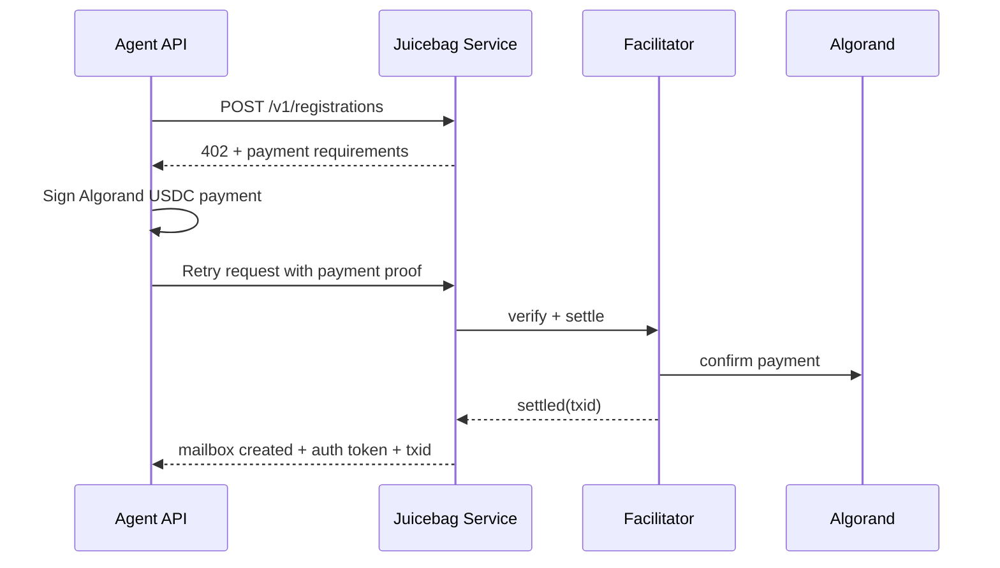
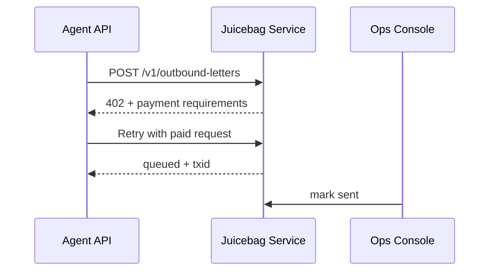
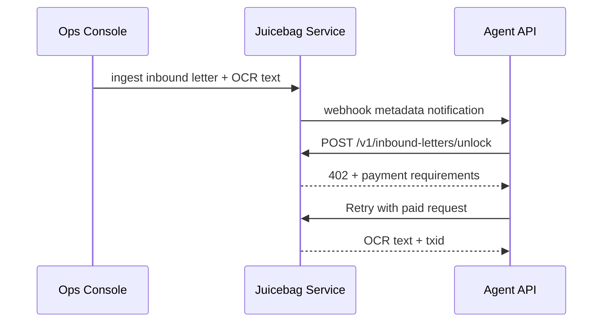

# Juicebag Mail Technical Plan

## Goal

Build a hackathon demo for **agentic commerce on Algorand** where:

1. An agent registers a physical mailbox/identity with Juicebag Mail.
2. The agent pays to send a physical letter.
3. Juicebag Mail notifies the agent about an incoming physical letter.
4. The agent pays to unlock the scanned/OCR'd contents.

The demo should prove two things clearly:

1. **The business flow works end-to-end.**
2. **Payments are enforced with x402 on Algorand TestNet.**

## Scope Decisions

These are the key scoping choices that keep the project hackathon-sized:

1. **Do not build on-chain mailbox logic.** x402 already handles payment gating; mailbox state should live in a normal application database.
2. **Do not integrate a real postal forwarding provider for the demo.** Treat forwarding setup as a paid registration event plus an operator-side record.
3. **Do not build full OCR automation first.** Let the Juicebag operator upload a PDF/image and paste OCR text manually, with optional OCR automation later.
4. **Use Algorand TestNet + USDC only.** Keep the whole demo on testnet.
5. **Use the hosted facilitator first.** Do not self-host the facilitator unless the hosted one blocks the demo.
6. **Use fixed-price `exact` payments.** Avoid dynamic pricing or metered billing in v1.
7. **Use a server-side agent for the customer demo.** This makes the “customer” feel like a real autonomous agent and avoids browser wallet friction.

## Main Design Decisions

### 1. Architecture

Use a small monorepo with four apps:

1. `apps/service-api`
   Juicebag Mail service. Owns paid endpoints, mailbox state, inbound/outbound letter records, operator actions, and notifications.
2. `apps/agent-api`
   Customer agent. Owns the agent wallet, pays Juicebag Mail over x402, receives notifications, and exposes a simple control surface for the demo UI.
3. `apps/demo-ui`
   A React UI with two panes:
   - `Agent Console`
   - `Juicebag Ops Console`
4. `apps/juicebag-mcp`
   Thin MCP server that exposes mailbox tools to AI agents by calling `agent-api`.

Use one shared package:

1. `packages/shared`
   Zod schemas, TypeScript types, event names, status enums, and shared price constants.

Use one local skill:

1. `skills/juicebag-mail`
   Skill instructions that teach an AI agent when to use the MCP tools and how to reason about mailbox flows.

### 2. Tech Stack

Use TypeScript everywhere.

- API framework: `Hono`
- Runtime: Node.js 20+
- Database: `SQLite` for local demo storage
- Binary asset storage: local filesystem under a service-owned `storage/` directory
- Validation: `zod`
- ORM/query layer: `drizzle-orm` with the `better-sqlite3` driver (avoid the built-in `node:sqlite`; it is experimental and Node 22+ only)
- PDF generation: `@react-pdf/renderer`
- x402 seller side: `@x402-avm/hono`, `@x402-avm/core`, `@x402-avm/avm`
- x402 buyer side: `@x402-avm/fetch`, `@x402-avm/core`, `@x402-avm/avm`
- Algorand key handling: `algosdk` (install explicitly — as of x402-avm v2.6+ it is no longer a transitive dependency)
- Algod access (buyer side only): AlgoNode TestNet `https://testnet-api.algonode.cloud` (public, no token)
- MCP server: `@modelcontextprotocol/sdk`

### 3. Payment Model

Use x402 `exact` pricing on three routes:

1. `POST /v1/registrations`
   Pays for mailbox setup / forwarding registration.
2. `POST /v1/outbound-letters`
   Pays for printing + stuffing + mailing.
3. `POST /v1/inbound-letters/unlock`
   Pays to unlock scanned letter contents.

Suggested demo prices:

- Registration: `$1`
- Outbound letter: `$0.05`
- Unlock inbound letter: `$0.2`

These are only demo prices. The point is to show three distinct x402 purchase flows, not realistic postage math.

### 4. Identity and Authorization

This is important: **x402 handles payment, not mailbox authorization**.

The service still needs to know which mailbox the caller is allowed to access. For the demo:

1. After successful registration, Juicebag Mail returns:
   - `agentId`
   - `mailboxId`
   - `agentAuthToken`
2. The agent includes `Authorization: Bearer <agentAuthToken>` on all future mailbox requests.
3. x402 remains the payment gate on paid routes.

This keeps the demo simple and prevents one paying agent from unlocking another agent's mail.

### 5. File and OCR Storage

Store original inbound/outbound document files on the **service side only**.

For the demo:

1. Store binary files on the service filesystem, not in SQLite.
2. Store only file metadata and file paths in the database.
3. Do **not** return file URLs to the agent.
4. After unlock, return **only OCR text** to the agent.
5. Keep original scans and generated PDFs visible only to the Juicebag Mail operator.

Recommended layout:

- `storage/inbound/<mailboxId>/<letterId>/scan.pdf`
- `storage/inbound/<mailboxId>/<letterId>/page-1.png`
- `storage/outbound/<mailboxId>/<letterId>/letter.pdf`

This is the simplest secure model for the hackathon demo and avoids building download authorization logic unless you later decide you need operator-side previews over HTTP.

### 6. Notifications

Use **signed webhooks** as the primary notification channel, with **polling fallback**.

At registration time, the agent provides:

- `webhook.url`

During successful registration, Juicebag Mail generates a per-agent `webhookSecret`, returns it to the agent **once**, and stores it encrypted at rest on the service side.

Recommended implementation:

1. Service generates a random 32-byte `webhookSecret`.
2. Service returns it in the registration response.
3. `agent-api` stores it locally and uses it to verify future webhooks.
4. `service-api` stores it encrypted with a master key such as `WEBHOOK_SECRET_MASTER_KEY`.

When inbound mail is ingested, Juicebag Mail sends:

- `POST {webhookUrl}`
- JSON body with mailbox-safe metadata only
- `X-JBM-Timestamp`
- `X-JBM-Signature`

If delivery fails:

1. Retry a few times with exponential backoff.
2. Leave the event available through a free polling endpoint.

This gives you a real push-based agent flow without introducing more infrastructure than necessary.

### 7. Discovery

For the first demo, hardcode the Juicebag Mail base URL in the agent config.

## System Diagram

```text
┌─────────────────┐      x402 over HTTP       ┌────────────────────┐
│ Agent API       │ ───────────────────────▶  │ Juicebag Service   │
│                 │                           │                    │
│ - agent wallet  │ ◀───────────────────────  │ - x402 seller      │
│ - webhook recv  │   JSON responses + txids  │ - mailbox DB       │
│ - inbox state   │                           │ - file storage     │
└───────┬─────────┘                           └─────────┬──────────┘
        │                                                 │
        │ AGENT_UI_TOKEN                                  │ ADMIN_UI_TOKEN
        ▼                                                 ▼
┌─────────────────┐                           ┌────────────────────┐
│ Demo UI         │                           │ Internal Service   │
│                 │                           │ Endpoints          │
│ - agent pane    │                           │                    │
│ - ops pane      │                           │ - GET /internal/*  │
│ - live logs     │                           │ - POST ingest mail │
└─────────────────┘                           │ - POST mark sent   │
                                              └────────────────────┘

┌─────────────────┐
│ Juicebag MCP    │
│                 │
│ - register      │
│ - send letter   │
│ - list inbox    │
│ - unlock letter │
│ - ignore letter │
└────────┬────────┘
         │ calls localhost
         ▼
    ┌───────────┐
    │ Agent API │
    └───────────┘
```

## Demo UI Design

Build one page with two side-by-side panes for demo clarity.

### Auth Model

Do not use `agentAuthToken` as the dashboard login.

Use:

- `AGENT_UI_TOKEN` for the agent pane to call `agent-api`
- `ADMIN_UI_TOKEN` for the operator pane to call `service-api`

Keep `agentAuthToken` internal to `agent-api` for calling Juicebag Mail.

### Agent Pane

Show:

- ALGO balance
- USDC balance
- registered physical mail identity and address
- inbound letters table
- outbound letters table
- compact x402 event log: only the last x402 event message

Inbound letter statuses:

- `pending`
  Agent was notified by webhook, but has not unlocked the OCR text yet.
- `received`
  Agent paid `inbound-letters/unlock` and fetched the OCR text.
- `ignored`
  Agent chose not to unlock the letter. This is local agent state only.

Outbound letter statuses:

- `queued`
- `sent`

Recommended row actions:

- inbound: `Unlock`, `Ignore`
- outbound: read-only for the first demo

### Juicebag Mail Operator Pane

Show:

- registered agents table with base info
- inbound letters table
- outbound letters table
- compact x402 event log: only the last x402 event message

Inbound letter statuses:

- `pending`
  Juicebag Mail has ingested the letter and notified the agent.
- `received`
  Agent paid to unlock the OCR text.

Outbound letter statuses:

- `queued`
  The service received the request but has not physically mailed it yet.
- `sent`
  Operator manually marked the letter as sent.

Recommended operator actions:

- `Register demo agent`
- `Ingest inbound letter`
- `Mark outbound as sent`

### Extra UI Elements Worth Adding

These are small additions with good demo value:

- top-level counters for registered agents, pending inbound letters, and queued outbound letters
- explorer link next to each payment txid
- webhook delivery status on the operator side
- live updates via SSE or short polling

## Service API Design

### Public Health Endpoint

- `GET /health`

Keep `GET /health` extremely simple.

Suggested response:

```json
{
  "status": "ok"
}
```

Do not add discovery or pricing logic there. For the demo, route prices should come from shared config in `packages/shared`, not from a catalog endpoint.

### Free Authenticated Agent Endpoints

These endpoints are free, but require:

- `Authorization: Bearer <agentAuthToken>`

- `GET /v1/inbound-letters`
  Returns metadata only for the authenticated agent.
- `GET /v1/outbound-letters`
  Returns submitted outbound jobs for the authenticated agent.
- `GET /v1/notifications`
  Polling fallback for undelivered notifications.

### Paid Endpoints

#### `POST /v1/registrations`

Request body:

```json
{
  "agentName": "Acme Filing Agent",
  "entityType": "company",
  "legalIdentity": {
    "name": "Acme GmbH",
    "street1": "Musterstrasse 1",
    "postalCode": "10115",
    "city": "Berlin",
    "country": "DE"
  },
  "webhook": {
    "url": "http://localhost:4022/webhooks/incoming-mail"
  }
}
```

Response body:

```json
{
  "agentId": "agt_123",
  "mailboxId": "mbx_123",
  "agentAuthToken": "jbm_demo_token",
  "webhook": {
    "secret": "jbm_whsec_123"
  },
  "status": "registered",
  "x402": {
    "txid": "..."
  }
}
```

`POST /v1/registrations` is paid, but does not require prior agent authentication.

#### `POST /v1/outbound-letters`

Requires:

- `Authorization: Bearer <agentAuthToken>`

Request body:

```json
{
  "mailboxId": "mbx_123",
  "recipient": {
    "name": "Finanzamt Berlin",
    "street1": "Finanzstrasse 5",
    "postalCode": "10117",
    "city": "Berlin",
    "country": "DE"
  },
  "subject": "Request for clarification",
  "bodyMarkdown": "Dear Finanzamt, ...",
  "sendMode": "standard"
}
```

Response body:

```json
{
  "letterId": "out_123",
  "status": "queued",
  "x402": {
    "txid": "..."
  }
}
```

#### `POST /v1/inbound-letters/unlock`

Static route on purpose. This avoids depending on path-parameter behavior inside x402 route config.

Requires:

- `Authorization: Bearer <agentAuthToken>`

Request body:

```json
{
  "mailboxId": "mbx_123",
  "letterId": "in_123"
}
```

Response body:

```json
{
  "letterId": "in_123",
  "status": "unlocked",
  "from": "Finanzamt Berlin",
  "receivedAt": "2026-06-06T10:00:00.000Z",
  "ocrText": "Sehr geehrte Damen und Herren, ...",
  "x402": {
    "txid": "..."
  }
}
```

### Internal Operator Endpoints

These are not x402-protected. Protect all `/internal/*` endpoints with:

- `Authorization: Bearer <ADMIN_UI_TOKEN>`

Read endpoints for the operator dashboard:

- `GET /internal/state`
  Returns registered agents, inbound letters, outbound letters, recent payments, recent webhook deliveries, and derived counters for the operator pane.

- `POST /internal/inbound-letters`
  Create a new inbound letter record for a mailbox.
- `POST /internal/outbound-letters/:id/mark-sent`

For the demo, keep file placement manual:

1. Operator creates the inbound letter record through `POST /internal/inbound-letters`.
2. Operator manually places the scan/PDF into the expected service storage folder.
3. Operator can include OCR text directly in the creation request or update it manually in storage/db during setup.

## Agent API Design

The customer agent is its own small service, not just a browser tab.

### Responsibilities

1. Hold the Algorand payer wallet.
2. Pay Juicebag Mail via x402.
3. Store mailbox credentials returned at registration.
4. Receive webhook notifications from Juicebag Mail.
5. Expose simple endpoints the demo UI can call.
6. Stream agent events to the UI over SSE.

### Agent Endpoints

- `GET /health`
- `GET /state`
  Current registration, wallet balances, inbox metadata, outbound jobs, and payment history.
- `POST /actions/register`
  Calls Juicebag Mail `POST /v1/registrations` using x402.
- `POST /actions/send-letter`
  Calls Juicebag Mail `POST /v1/outbound-letters` using x402.
- `POST /actions/unlock-letter`
  Calls Juicebag Mail `POST /v1/inbound-letters/unlock` using x402.
- `POST /actions/ignore-letter`
  Marks an inbound letter as ignored in local agent state only.
- `POST /webhooks/incoming-mail`
  Receives notifications from Juicebag Mail.
- `GET /events`
  SSE endpoint for UI event streaming.

Protect the agent dashboard endpoints with:

- `Authorization: Bearer <AGENT_UI_TOKEN>`

Apply that to:

- `GET /state`
- `GET /events`
- `POST /actions/*`

Do **not** require `AGENT_UI_TOKEN` on `POST /webhooks/incoming-mail`; that route is authenticated by webhook signature verification instead.

### Why a Server-Side Agent

This is the best choice for the hackathon because:

1. It behaves like an autonomous buyer.
2. It can receive webhooks directly.
3. It can manage wallet state without browser wallet UX.
4. It lets the UI focus on observability, not signing.

If you later want a human-controlled version, you can swap in Web3Auth or a wallet connector on the UI side.

## AI Agent Integration

Expose Juicebag Mail to AI agents through two layers:

1. `juicebag-mcp`
   An MCP server that turns mailbox actions into native tools.
2. `juicebag-mail` skill
   A lightweight skill that teaches the agent how and when to use those tools.

### `juicebag-mcp`

Keep this server thin. It should call `agent-api`, not duplicate wallet or x402 logic. Build it with `@modelcontextprotocol/sdk` over stdio.

Recommended tools:

- `register_mailbox`
- `get_agent_state`
- `list_inbound_mail`
- `list_outbound_mail`
- `send_letter`
- `unlock_letter`
- `ignore_letter`

This gives an AI agent a native tool surface while preserving one implementation of:

- wallet handling
- x402 payment flow
- webhook processing
- mailbox authorization

### `juicebag-mail` Skill

The skill should instruct an AI agent to:

1. register before attempting mail operations,
2. treat `pending` inbound letters as metadata-only until unlock is paid,
3. unlock only when the OCR text is actually needed,
4. use `ignore_letter` for junk or low-priority mail,
5. surface txids and payment outcomes clearly to the user.

The skill is guidance only. The MCP server is what makes the interaction native and executable.

In general, keep the skill simple, I will flesh it out myself later.

## Notification Design

### Event Sent by Juicebag Mail

When a new physical letter is ingested:

```json
{
  "eventId": "evt_123",
  "type": "inbound_letter.received",
  "agentId": "agt_123",
  "mailboxId": "mbx_123",
  "letter": {
    "letterId": "in_123",
    "from": "Finanzamt Berlin",
    "receivedAt": "2026-06-06T10:00:00.000Z",
    "pageCount": 2,
    "envelopeSummary": "Tax authority letter"
  }
}
```

Do **not** include OCR text in the webhook. The text is the paid asset.

### Webhook Security

Use:

- `X-JBM-Timestamp`
- `X-JBM-Signature`

The signature is `HMAC-SHA256(timestamp + "." + rawBody, webhookSecret)`.

Simple working model for the demo:

1. The agent sends only `webhook.url` during registration.
2. Juicebag Mail generates `webhookSecret` during registration.
3. Juicebag Mail returns that secret once in the registration response.
4. `agent-api` stores the secret locally and verifies all future callbacks with it.
5. `service-api` stores the secret encrypted at rest using `WEBHOOK_SECRET_MASTER_KEY`.

The agent should:

1. Verify the signature.
2. Reject timestamps older than 5 minutes.
3. Store the event idempotently by `eventId`.

### Polling Fallback

If webhooks fail, the agent can call:

- `GET /v1/notifications?cursor=...`

This endpoint should be free and auth-protected, since it only returns metadata.

## Data Model

### `agents`

- `id`
- `display_name`
- `mailbox_id`
- `auth_token_hash`
- `webhook_url`
- `webhook_secret_encrypted`
- `wallet_label`
- `created_at`

### `mailboxes`

- `id`
- `entity_type`
- `legal_name`
- `street1`
- `street2`
- `postal_code`
- `city`
- `country`
- `status`
- `created_at`

### `outbound_letters`

- `id`
- `mailbox_id`
- `recipient_json`
- `subject`
- `body_markdown`
- `pdf_path`
- `status`
  Service-side values: `queued`, `sent`
- `payment_txid`
- `created_at`
- `sent_at`

### `inbound_letters`

- `id`
- `mailbox_id`
- `from_name`
- `received_at`
- `page_count`
- `envelope_summary`
- `pdf_path`
- `ocr_text`
- `status`
  Service-side values: `pending`, `received`
- `unlock_payment_txid`
- `created_at`

### `payments`

- `id`
- `route_key`
- `agent_id`
- `mailbox_id`
- `txid`
- `amount_usd`
- `network`
- `pay_to`
- `status`
- `created_at`

### `agent_letter_states`

Local state stored by `agent-api` for UI and agent behavior.

- `letter_id`
- `status`
  Agent-side values: `pending`, `received`, `ignored`
- `ignored_at`
- `unlocked_at`
- `updated_at`

### `webhook_deliveries`

- `id`
- `event_id`
- `agent_id`
- `target_url`
- `status`
- `attempt_count`
- `last_attempt_at`

## Flow Details

### Flow 1: Registration



Result:

- mailbox created
- auth token issued
- webhook secret issued
- txid stored and shown in UI

### Flow 2: Send a Letter



Result:

- outbound job visible in both UIs
- service stores printable PDF internally for operator use
- x402 txid visible

### Flow 3: Receive and Unlock a Letter



Result:

- agent gets notified before seeing content
- content unlock is separately monetized
- payment trail is shown clearly

## x402 Implementation Notes

Use the `@x402-avm/*` package family (the Algorand/AVM build of x402) end-to-end for this project. Do **not** install the plain `@x402/*` packages — those exist on npm but are the canonical EVM build and contain no Algorand scheme, so the demo would fail silently.

### Seller Side

Follow the GoPlausible `@x402-avm` Hono pattern. Imports and registration:

```ts
import { paymentMiddleware, x402ResourceServer } from "@x402-avm/hono";
import { registerExactAvmScheme } from "@x402-avm/avm/exact/server";
import { HTTPFacilitatorClient } from "@x402-avm/core/server";
import { ALGORAND_TESTNET_CAIP2, USDC_TESTNET_ASA_ID } from "@x402-avm/avm";

const facilitatorClient = new HTTPFacilitatorClient({ url: FACILITATOR_URL });
const server = new x402ResourceServer(facilitatorClient);
registerExactAvmScheme(server);

app.use(paymentMiddleware(routes, server));
```

Notes:

1. Register the scheme with `registerExactAvmScheme(server)` — there is no `register(CAIP2, new ExactAvmScheme())` call.
2. `paymentMiddleware` takes a `routes` object that maps `"<METHOD> <path>"` to an `accepts` block (`scheme: "exact"`, `network: ALGORAND_TESTNET_CAIP2`, `payTo`, `price` as a `"$0.05"`-style string).
3. The seller does **not** need an Algod endpoint; verification and settlement are delegated to the facilitator.

Start with:

- `FACILITATOR_URL=https://facilitator.goplausible.xyz` (the GoPlausible facilitator is the Algorand one; do **not** use `https://x402.org/facilitator`, which is EVM-oriented)
- `NETWORK=testnet`
- a TestNet USDC receiving address as `SELLER_ADDRESS` (it must be opted in to USDC — see Wallet Setup)

### Buyer Side

Use the server-side agent pattern. Imports and setup:

```ts
import { x402Client } from "@x402-avm/core/client";
import { registerExactAvmScheme } from "@x402-avm/avm/exact/client";
import { toClientAvmSigner } from "@x402-avm/avm";
import algosdk from "algosdk";

// mnemonic -> 64-byte secret key -> base64 (the format toClientAvmSigner expects)
const sk = algosdk.mnemonicToSecretKey(AGENT_MNEMONIC).sk;
const signer = toClientAvmSigner(Buffer.from(sk).toString("base64"));

const client = new x402Client({ schemes: [] });
registerExactAvmScheme(client, {
  signer,
  algodConfig: { algodUrl: ALGOD_URL }, // e.g. https://testnet-api.algonode.cloud
});

const res = await client.fetch(url, { method: "POST", body });
```

Notes:

1. Register the scheme with `registerExactAvmScheme(client, { signer, algodConfig })` — not `new ExactAvmScheme(signer)`.
2. The buyer **does** need an Algod endpoint (`algodConfig.algodUrl`) to fetch suggested transaction params when building the payment. AlgoNode TestNet works with no token.
3. Pay requests via `client.fetch(...)`. (`wrapFetchWithPayment` from `@x402-avm/fetch` is an equivalent alternative if you prefer wrapping the global `fetch`.)

The agent should decode and store the `payment-response` header (base64 JSON containing the settlement txid) so the UI can show the txid after each purchase.

### Wallet Setup

For the demo, create two Algorand TestNet accounts:

1. `service wallet`
   Receives USDC payments.
2. `agent wallet`
   Pays USDC via x402.

Both accounts need:

1. TestNet ALGO for fees and minimum balance — fund via `algokit dispenser fund <addr>` or the web faucet `https://bank.testnet.algorand.network`.
2. TestNet USDC opt-in (ASA ID `10458941`). The `service wallet` must opt in as well, or it cannot receive payment.
3. TestNet USDC balance — from the Circle faucet `https://faucet.circle.com` (select Algorand TestNet).

Only the `agent wallet` needs an Algod endpoint at runtime (to build payments); the `service wallet` settles through the facilitator.

## Suggested Repository Layout

```text
apps/
  service-api/
    src/
      index.ts
      x402.ts
      routes/
      db/
      notifications/
      pdf/
  agent-api/
    src/
      index.ts
      juicebagClient.ts
      wallet.ts
      webhook.ts
      state.ts
  juicebag-mcp/
    src/
      index.ts
      tools/
  demo-ui/
    src/
      pages/
      components/
      hooks/
      api/
packages/
  shared/
    src/
      schemas.ts
      events.ts
      statuses.ts
skills/
  juicebag-mail/
    SKILL.md
docs/
  technical-plan.md
```

## Local Spin-Up Plan

### Service API

- Port `4021`
- Uses local SQLite database
- Uses service TestNet wallet

### Agent API

- Port `4022`
- Uses agent TestNet wallet
- Registers webhook URL as `http://localhost:4022/webhooks/incoming-mail`

### Juicebag MCP

- Runs over MCP stdio for the AI client
- Calls `agent-api` on localhost
- Does not own wallet secrets directly

### Demo UI

- Port `5173`
- Calls both APIs (both `service-api` and `agent-api` must enable CORS for the `http://localhost:5173` origin)
- Shows:
  - route prices
  - decoded payment requirements
  - txids
  - inbox/outbox state
  - operator actions

This local-first setup is enough for a live hackathon demo and avoids tunnel/deployment complexity.

## Implementation Order

1. Scaffold the monorepo and shared types.
2. Implement `service-api` with health route and seeded dummy data.
3. Add x402 to `POST /v1/registrations`.
4. Implement `agent-api` registration action using `wrapFetchWithPayment`.
5. Scaffold `juicebag-mcp` as a thin wrapper around `agent-api`.
6. Write the `juicebag-mail` skill instructions around the MCP tools.
7. Add the registration view to the UI and display txids.
8. Add outbound letter submission and internal PDF generation.
9. Add internal inbound letter ingestion.
10. Add webhook notifications to the agent.
11. Add paid unlock flow for inbound letters.
12. Add polish: payment log, explorer links, status chips, seeded demo data.

## Recommended Use of the Algorand Skills Repo

The most useful skills from `algorand-devrel/algorand-agent-skills` for this project are:

1. `algorand-x402-typescript`
   Best fit for the core Juicebag Mail payment flows.
2. `algorand-project-setup`
   Useful if you want AlgoKit-style project scaffolding, but not required.
3. `algorand-frontend`
   Useful only if you later move the buyer to a browser wallet UX.

For this hackathon demo, the x402 TypeScript guidance is the only one that feels directly central.

## Final Recommendation

Build Juicebag Mail as a **plain off-chain Hono service with three x402-paid routes**, plus a **server-side customer agent** that pays with an Algorand TestNet wallet, receives signed webhook notifications, and exposes a thin **MCP tool layer** for native AI usage.

That gives you:

1. a believable agent commerce story,
2. visible Algorand x402 payments,
3. clean demo flows for registration, send, and receive,
4. minimal infrastructure,
5. the fastest path to a working prototype.

## Sources

- Algorand x402 guide: https://dev.algorand.co/resources/x402-on-algorand/
- Algorand x402 developer overview: https://algorand.co/agentic-commerce/x402/developers
- x402 buyer quickstart: https://docs.x402.org/getting-started/quickstart-for-buyers
- x402 seller quickstart: https://docs.x402.org/getting-started/quickstart-for-sellers
- GoPlausible x402-avm docs (authoritative package/API reference): https://github.com/GoPlausible/.github/tree/main/profile/algorand-x402-documentation
- GoPlausible x402 facilitator: https://x402.goplausible.xyz/
- Reference demo repo: https://github.com/camohe90/x402
- Algorand agent skills repo: https://github.com/algorand-devrel/algorand-agent-skills/tree/main/skills
